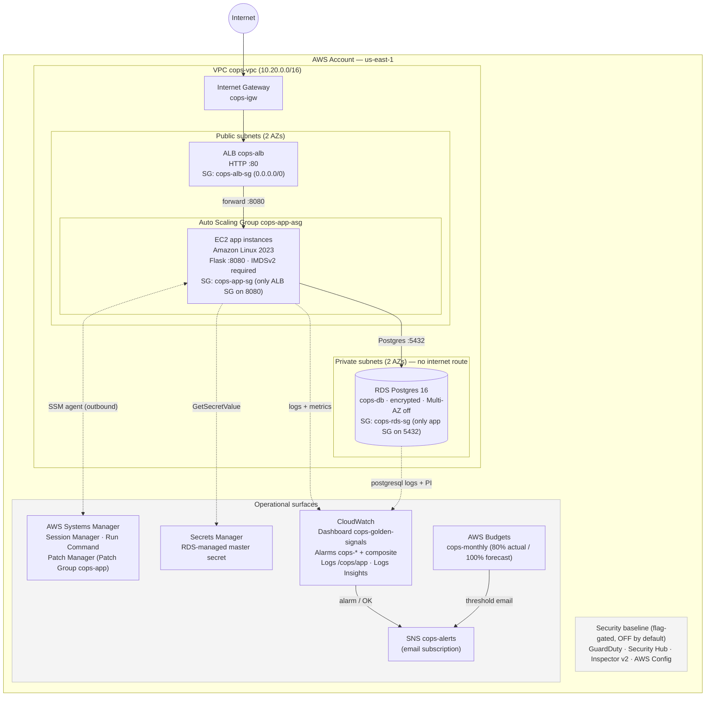

# Architecture — AWS Cloud Ops Lab

Region `us-east-1`. Every resource carries the `cops` prefix. The stack is
built to be stood up and torn down on demand for day-2 operations practice, so
it deliberately trades some production hardening for lower cost (see the ADRs
in this folder).

## Diagram

## Request path

1. A client resolves `cops-alb`'s public DNS name and connects over **HTTP :80**.
   `cops-alb-sg` is the only security group open to `0.0.0.0/0`, and only on
   port 80.
2. The ALB listener forwards to target group `cops-app-tg` on **:8080**. Targets
   are the EC2 instances registered by the `cops-app-asg` Auto Scaling Group.
   Health checks hit `GET /health` expecting `200` (15s interval, healthy after
   2 checks). ASG health check type is `ELB`, so a target that fails the ALB
   check is replaced.
3. Each instance runs the **Flask app on :8080** on Amazon Linux 2023. Inbound
   on 8080 is allowed only from `cops-alb-sg` — nothing else on the network can
   reach the app port, and there is **no SSH** rule at all.
4. The app reads the database endpoint and credentials and connects to
   **RDS Postgres `cops-db` on :5432**. `cops-rds-sg` accepts 5432 only from
   `cops-app-sg`. RDS lives in the private subnets, is not publicly accessible,
   and its route table has no default route to the internet.

Instances sit in the **public subnets** (they get a public IP for outbound
package/SSM/Secrets traffic through the IGW) but are firewalled at the security
group so the only ingress is the ALB. This avoids a NAT gateway; the honest
trade-off is documented in ADR-002.

## Operational surfaces

**Observability.** A `/health` endpoint drives target health. The
`cops-golden-signals` CloudWatch dashboard (defined in
`terraform/observability.tf`) covers traffic, errors, latency (p50/p95),
target saturation, and RDS CPU/connections. Alarms are split into
customer-facing symptoms (`cops-alb-5xx`, `cops-alb-latency-p95`) and causes
(`cops-unhealthy-targets`, `cops-rds-cpu`, `cops-rds-connections`), rolled up
into a single composite `cops-service-health`. Each alarm description names the
runbook to open. Alarm and OK transitions publish to the **`cops-alerts` SNS
topic** (email subscription when `alarm_email` is set). Application logs ship to
the **`/cops/app`** log group via the CloudWatch agent; saved Logs Insights
queries live alongside the dashboard. RDS exports `postgresql` logs and has
Performance Insights enabled.

**Patching.** Instances are **SSM-managed** through the
`AmazonSSMManagedInstanceCore` role — Session Manager for shell access (no SSH
keys, no bastion), Run Command, and **Patch Manager** targeting the
`Patch Group = cops-app` tag. This is the surface for the patch-compliance drill.

**Backup / recovery.** RDS runs daily automated backups (7-day retention,
07:00–07:30 window), which are the source for the point-in-time / snapshot
restore-test drill. The ASG itself provides instance-level recovery: terminate
an instance and the group relaunches it and re-registers it behind the ALB —
the basis for the instance-failure drill.

**Security.** Access to instances is SSM-only; `http_tokens = required` enforces
**IMDSv2**. Database credentials are never in code — RDS creates and rotates a
**Secrets Manager**-managed master secret, and the instance role can read only
that one secret ARN. Storage is encrypted. An optional **account-wide security
baseline** (GuardDuty, Security Hub, Inspector v2, AWS Config) is gated behind
`enable_security_baseline` and is **off by default** because those services are
account-level and bill separately; enable it deliberately for the
security-findings drill.

**Cost guardrail.** The `cops-monthly` AWS Budget emails at 80% actual and 100%
forecasted spend (default limit `$20`).
